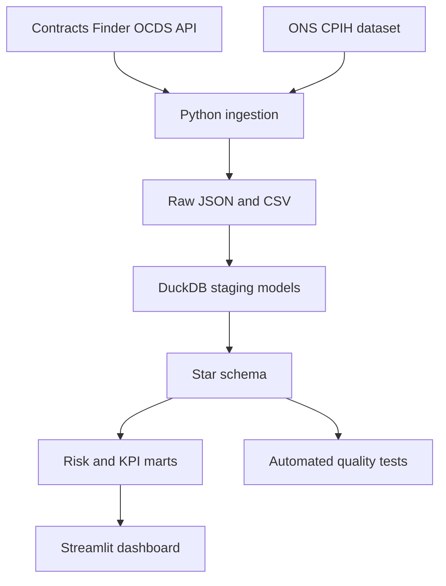

# UK Public Procurement Intelligence Platform

An end-to-end analytics engineering project that converts UK public contracting notices into decision-ready procurement intelligence. It demonstrates API ingestion, dimensional modelling, data-quality controls, analytical SQL, risk scoring, and an interactive executive dashboard.

## Business questions

- Which buyers, suppliers, and procurement categories account for the highest awarded value?
- Where is supplier concentration creating continuity or competition risk?
- Which awards are unusually large relative to their category and buyer peer group?
- How does nominal contract value compare after inflation adjustment?
- Which suppliers show signs of dependency on a small number of public-sector buyers?

## Architecture



## Analytical model

- `dim_date`: reusable calendar and fiscal attributes
- `dim_buyer`: contracting authorities
- `dim_supplier`: awarded organisations
- `dim_category`: procurement classifications
- `fact_award`: award-grain value, dates, buyer, supplier, and category
- `mart_supplier_risk`: concentration, dependency, anomaly, and composite risk indicators
- `mart_monthly_spend`: nominal and CPIH-adjusted procurement trends

## Quick start

```bash
python -m venv .venv
source .venv/bin/activate
pip install -r requirements.txt
python src/pipeline.py --fixture
streamlit run dashboard/app.py
```

Use `python src/pipeline.py --live` to request current notices from the official API. The fixture mode is deterministic and makes the repository fully testable without network access.

## Key metrics

- Total and inflation-adjusted awarded value
- Buyer and supplier market share
- Herfindahl-Hirschman Index (HHI) for supplier concentration
- Award-size anomaly flags
- Supplier dependency by dominant buyer
- Composite procurement risk score (0–100)

## Data sources

- [Contracts Finder API](https://www.contractsfinder.service.gov.uk/apidocumentation), UK Cabinet Office
- [ONS consumer price inflation time series](https://www.ons.gov.uk/economy/inflationandpriceindices/datasets/consumerpriceindices), Office for National Statistics

Public information is used for analytical demonstration. Risk indicators are screening signals, not allegations or compliance determinations.

## Repository structure

```text
dashboard/       Streamlit executive dashboard
data/fixtures/   Small deterministic OCDS-style test dataset
docs/            Data dictionary and methodology
sql/             Warehouse and analytical mart models
src/             Ingestion, validation, and orchestration
tests/           Unit tests for core calculations
.github/         CI workflow
```

## Engineering quality

The pipeline is idempotent, validates required fields, uses parameterised execution, and separates raw, staging, dimensional, and mart layers. CI runs syntax validation and unit tests on every push and pull request.
